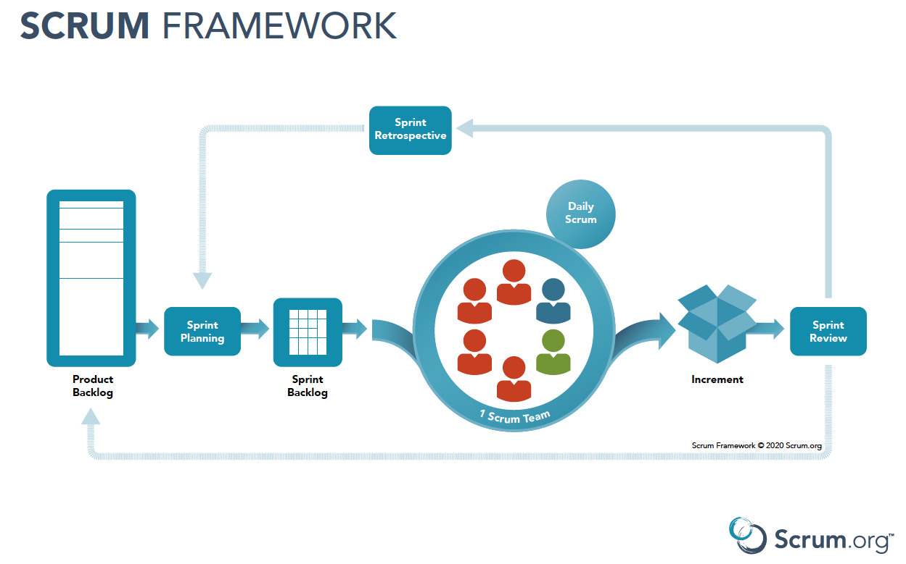

# Software Development Life Cycle (SDLC)

- Execution and monitoring phases of project life cycle
- Not involved in initiation, planning or closing

## Waterfall

### Pros

- Linear
- Clear structure with defined endpoint
- Easy to plan ahead
- Clear requirements
- Easy to track progress

### Cons

- Inflexible
- Changes to requirements cause delays
- More upfront investment from stakeholders
- Late feedback from customers and stakeholders
- Problems emerge late

# Agile

## Core Values

- Individuals and interactions over projects and tools
- Working software over comprehensive documentation
- Customer collaboration over contract negotiation
- Responding to change over following a plan

## Principles

- Iterative and incremental
- Collaborative
- Customer-focused
- Adaptable

## Methodologies

Frameworks
- TDD = Test-Driven Development
- Lean
- XP = Extreme Programming
- Scrum
- FDD = Feature-Driven Development
- Kanban
- BDD = Behaviour-Driven Development

# Scrum



## Artifacts

- Product backlog
- Sprint backlog
- Increment

## Ceremonies

- Sprint planning
- Sprint review
- Sprint retrospective

## Pillars

- Transparency
- Inspection
- Adaptation

## Team

- Product Owner = manages product backlog and communicates with stakeholders
- Scrum Master = part of the scrum team and responsible for facilitating the process
- Developers = self-managing and cross-fucntional team who create the product

## Requirements

- Functional requirements = what the system does (e.g. login, order placement)
- Non-functional requirements = how the system behaves (e.g. transaction speed, data encryption)

## Elicitation

- Observation
- Workshops
- Interviews
- Document analysis
- Brainstorming
- Surveys and questionnaires
- Prototyping

# User Stories

AS A `type of user` I WANT `goal` SO THAT `reason`
- Independent
- Negotiable
- Valuable
- Estimable
- Small
- Testable

Epic = big requirement that can be broken up into smaller actionable user stories
```
As a new user, I want to register for an account, so that I can access the system
```

User story = small requirement that can be developed as a piece of work
```
- As a new user, I want to register with a valid username and password, so that I can receive confirmation that my account has been created
- As a new user, I want to receive an error message when I enter an invalid username or password, so that I know what needs to be corrected
- As a new user, I want to confirm my email address, so that my account can be verified and activated
```

## Magnificent 7

Stakeholders required to discuss user stories
- **Product owner** (why)
- End user (who)
- **Developer** (how)
- **Tester** (what if)
- DevOps (where)
- Scrum Master (process)
- Compliance Expert (rules)

## Acceptance Criteria

How you know when a user story is complete

Gherkin scenario (happy)
- GIVEN `I am on the registration page`
- WHEN `I enter a valid username and password`
- THEN `I get sent a confirmation email`

Gherkin scenario (sad)
- GIVEN `I am on the registration page`
- WHEN `I enter an invalid password`
- THEN `I get an invalid password error message`

## 3 Cs

- Card = user story
- Conversation = discussion
- Confirmation = acceptance criteria

## Prioritisation

User stories are placed on the product backlog in order of priority
- Planning poker
    - Estimate effort
- MoSCoW
    - Must have
    - Should have
    - Could have
    - Won't have

### Minimum Viable Product (MVP)

Version of a new product which allows a team to collect the maximum amount of validated learning about customers with the least effort

### Definition of Done (DoD) and Definition of Ready (DoR)

- Checklist of prerequisites (DoR) or necessary actions for completion (DoD)
- Generic and applicable to all items (e.g. user story, sprint) within that project