# Statistics

## Averages

### Mean

Arithmetic average
```
sum of values / number of values
```

### Median

Middle value
 - odd number of values
	 ```
	 ((number of values + 1) / 2)th term
	 ```
- even number of values
	 ```
	  ((number of values / 2)th term + ((number of values + 1) / 2)th term) / 2
	 ```

### Mode

Most frequent value

## Standard Deviation

How much individual data points spread out from mean value
```
1. Calculate mean of values
2. Subtract mean from each value to find deviation
3. Square deviations for each value to eliminate negatives
4. Calculate mean of squared deviations to find variance
   - for sample, minus 1 from number of values
1. Square root of variance = standard deviation
```

## Distribution

### Normal Distribution

Data distributed symmetrically

`Bell curve`

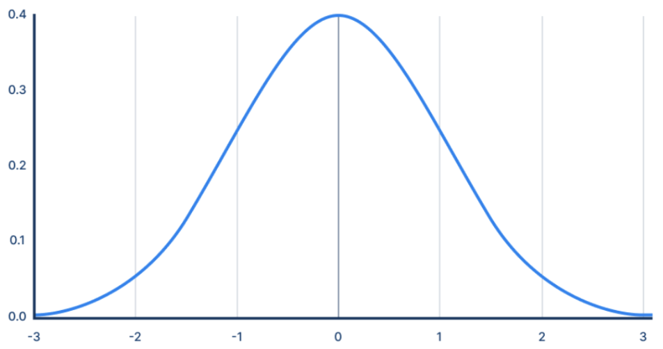

### Positive Skew

Data skewed towards larger values

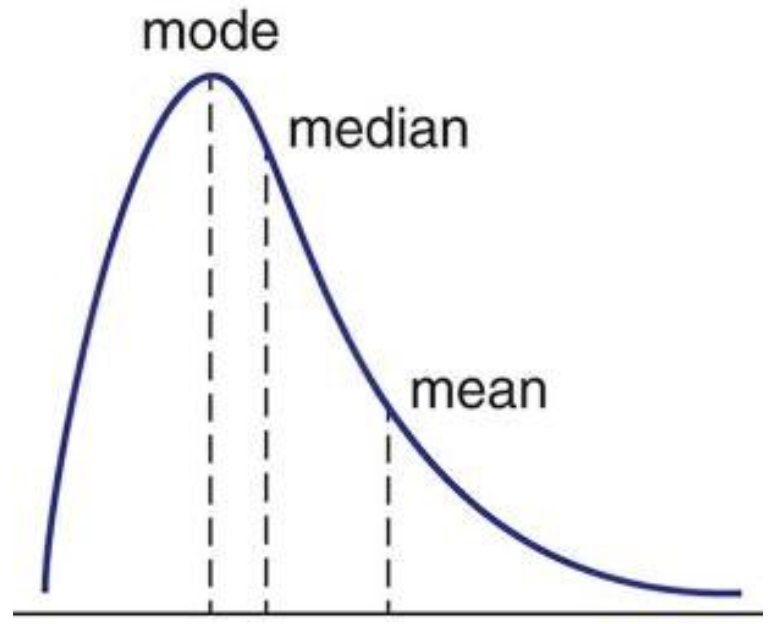

### Negative Skew

Data skewed towards smaller values

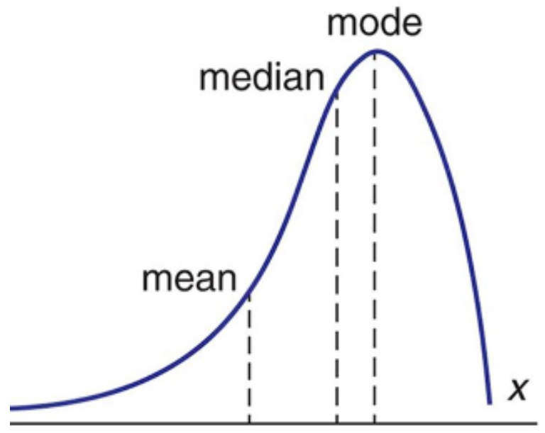

### Histogram

Approximate representation of distribution

`Values grouped into bins`

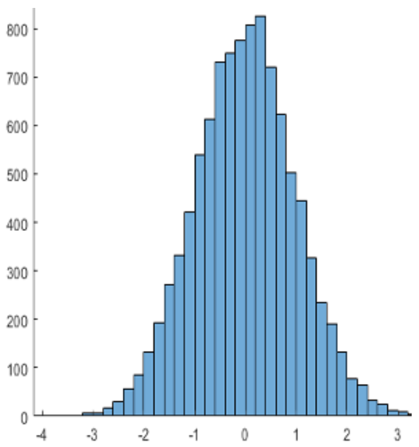

### Box Plot

Representation of distribution using percentiles

`Can be used to detect outliers`

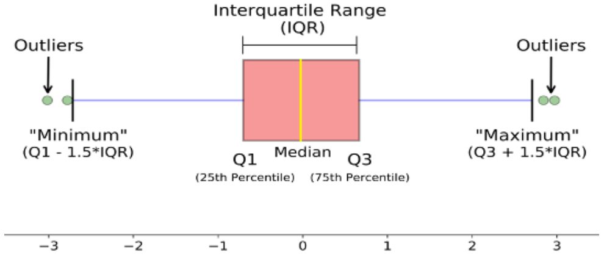

## Correlation Coefficient

### Correlation

Linear relationship between two continuous variables

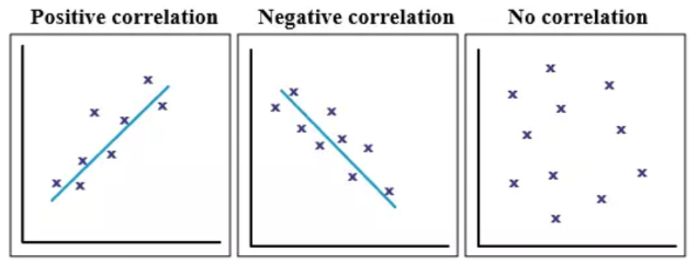

### Pearson's r

How closely the two variables are related

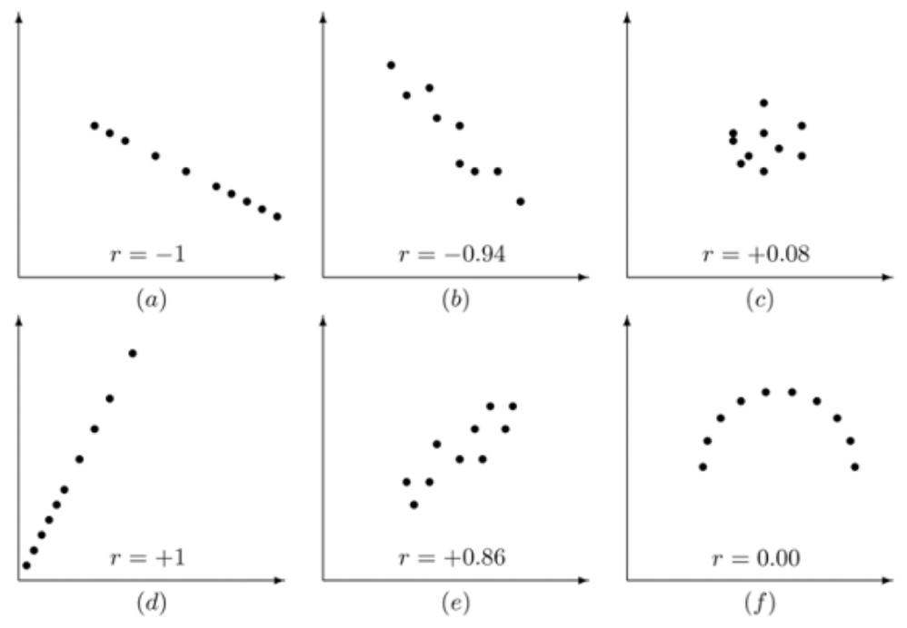

### R2

Amount of variation in one variable that can be explained by the other

# Data Types

## Quantitative

- Integer = whole number
- Float = decimal
- Discrete = countable values (e.g. number of people)
- Continuous = measurable (e.g. height)

## Qualitative

- Character
- String
- Categorical (e.g. marital status)

## Datetime

- Date
- Time
- Datetime

## Unix Time

- Number of seconds elapsed since unix epoch
- Can be read by any program in any time zone
- Programming languages can convert to datetime

## Boolean

- Used with logical operators to create true/false statements
- Only two possible values
	- True (1)
	- False (0)

## Key-Value Pair

- Key = identifier used to locate data
- Value = data or variable assigned to key
- e.g. `{name: "John", age: 40}`

# Data Quality

## Validity

Values which violate defined constraints such as:
- data type (e.g. numeric, boolean, date)
- range (e.g. age, height)
- regular expression (e.g. phone number, postcode)

## Accuracy

Difficult to ascertain but can be inferred if there are inconsistencies within a dataset

## Consistency

Contradicting values within a set (e.g. individual with children who has a birthdate that would make them a baby)

## Uniformity

Values following different units of measure (e.g. height in both metric and imperial)

## Completeness

Missing or truncated data

## Redundancy

Repeated entries (e.g. accidental input)

# Data Cleaning

## Typo

- Pattern matching
	- Specify a letter and match words that begin with that letter (e.g. f, fem, female)
- Fuzzy matching
	- Specify threshold for number of allowable errors (e.g. Samzung or Sanzung to match Samsung)

## Drop

Remove or hide:
- Irrelevant data
- Duplicates
- Datasets with missing values (depending on algorithm or defined threshold)

## Flag

Document missing data

## Impute

- Interpolation = replace missing data with average for that specific column
- Hot deck = replace missing data with values from similar records in same dataset
- Cold deck = replace missing data with values from similar records in another dataset

## Type Conversion

Covert data type (e.g. categorical values to numbers, strings to date objects)

## Padding

Add extra characters or digits to fit length constraints (e.g. 000124)

## Standardisation

Put each value in the same format so they are uniform (e.g. converting measurements or currency)

## Scaling

Scale data values to a specified range (e.g. converting exam scores to percentages)

## Normalisation

Rescale data values into a range between 0-1
```
(number - minimum number) / (maximum number - minimum number)
```

# Critical Thinking

- Question whether data source is biased or unreliable
- Identify irrelevant or missing data
- Ensure data are presented appropriately
- Identify possible alternative explanations
- Verify that assertations are supported by evidence

# Data Visualisation

## Tables

- Numbers right aligned
- Text left aligned
- Equal spacing for columns
- Consistent measurements with clear units
- Appropriate level of precision
- Colour used sparingly

## Line Chart

Time series data

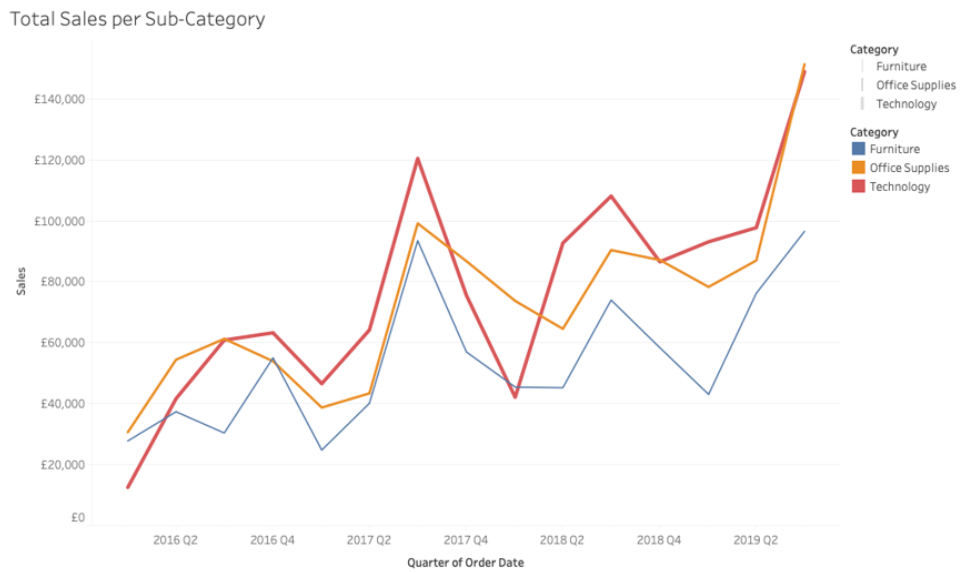

## Small Multiples Line Chart

Time series data with more than four categories

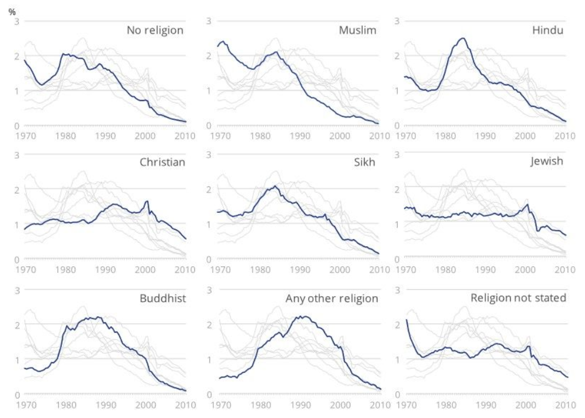

## Slope Chart

Highlight differences between certain points in time

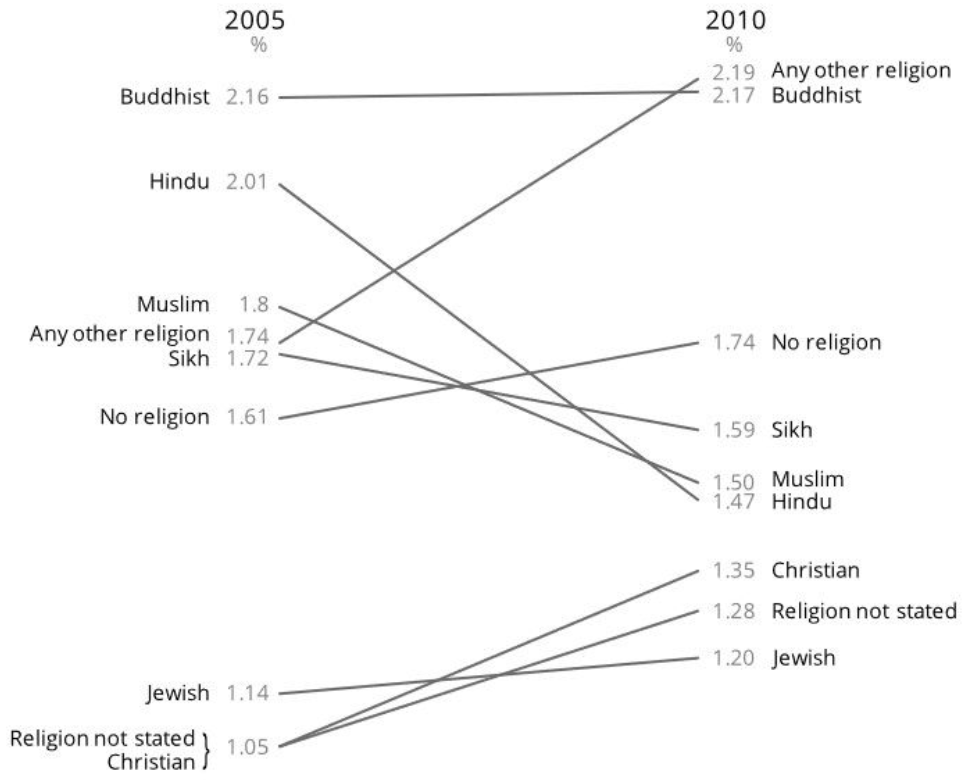

## Bar Chart

Compare magnitudes across categories

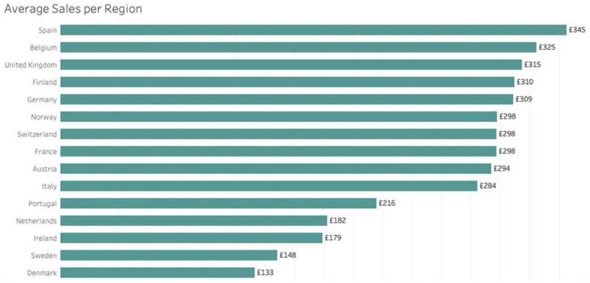

## Clustered Bar Chart

Compare magnitudes across and within subcategories

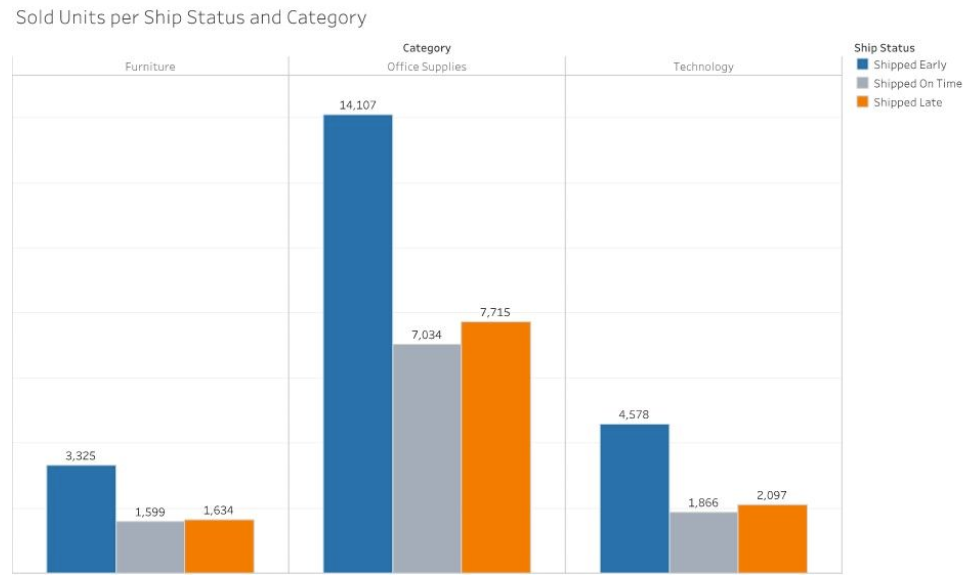

## Deviation Bar Chart

Compare differences to a set value (e.g. the mean)

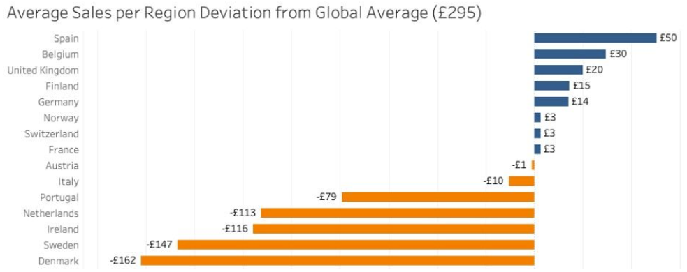

## Stacked Bar Chart

Best for percentages

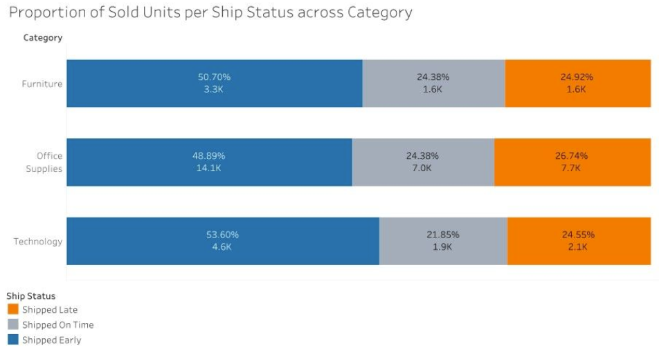

## Scatter Plot

Compare two continuous variables

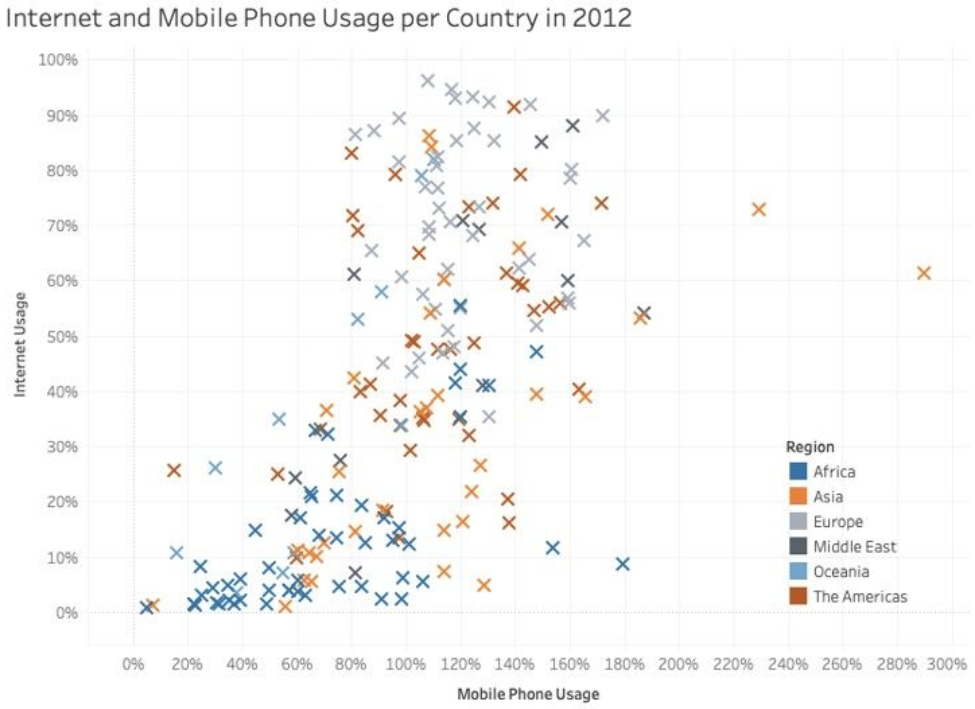