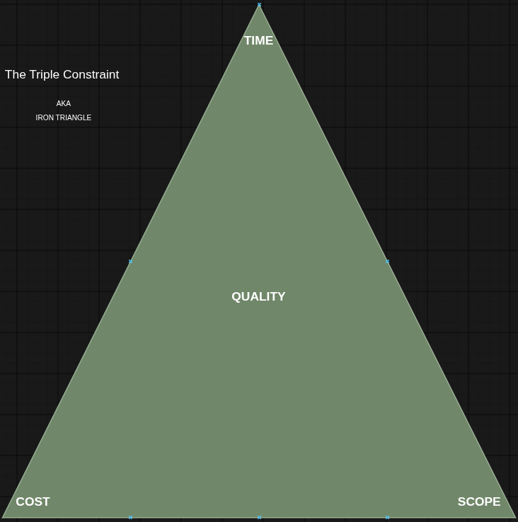
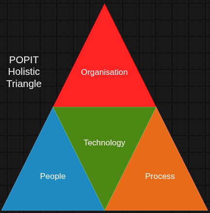
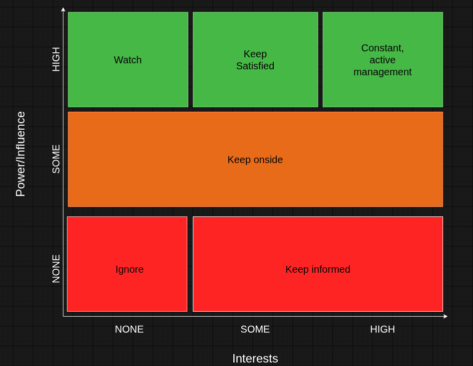

# Projects

## Key Terms

- Project = temporary piece of work with a defined outcome
- Programme = group of related projects with a broader goal

## Project Life Cycle

1. Initiation
2. Planning
3. Execution
4. Monitoring
5. Closing

## The Triple Constraint

Interdependent = each will affect the others and all affect quality

## POPIT Holistic Triangle

Different areas of an organisation that must be considered when implementing a change

# Stakeholders

## Categories

- Partners
- Suppliers
- Regulators
- Employees
- Managers
- Owners
- Competitors
- Customers

## Stakeholder Attitudes

- Champion = actively works for the success of the project
- Supporter = in favour of the project but not actively encouraging it
- Neutral = neither for nor against the project
- Critic = not in favour of the project but not actively opposing it
- Opponent = actively works to obstruct the project
- Blocker = prevents the project from progressing

## Power-Interest Grid

