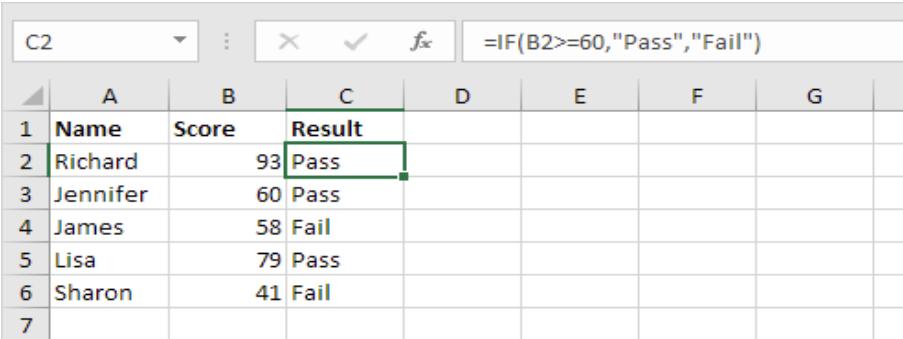
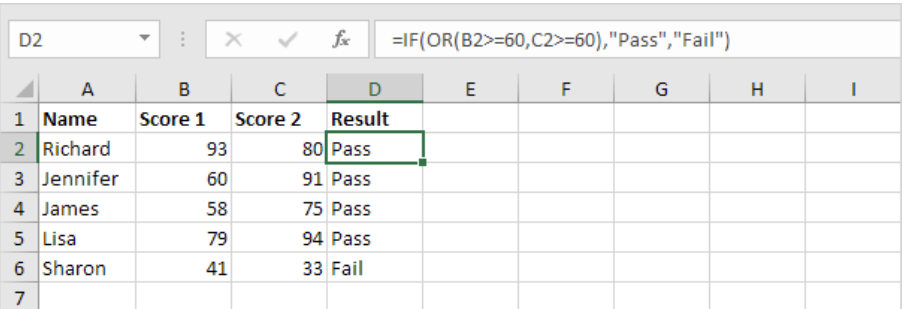
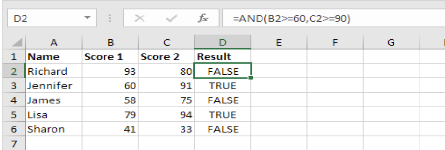
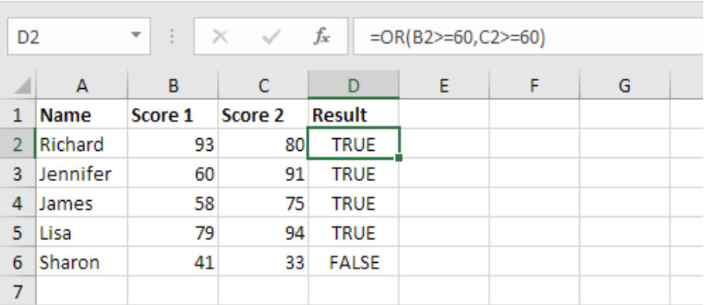
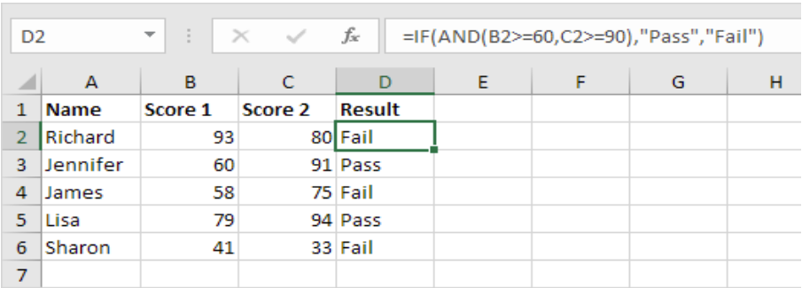
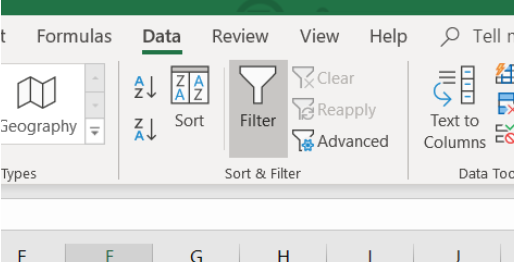
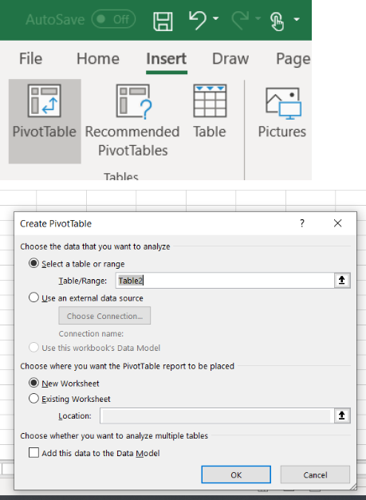
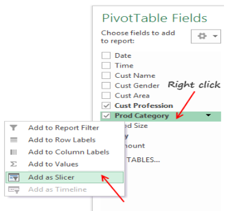

# Basics

- `cell:cell` = range
- `Sheet!cell` = references cells on another sheet
- `*` and `?` = wildcards
- `&` = combines two cells
- `cell&" "&cell` = combines two cells with a space in the middle
- `cell&", "&cell` = combines two cells with a space in the middle
- `"Text: "&cell` = combines text with cells
- `$column$row` = row and column stays fixed when copied

## Operators

- `+` = addition
- `-` = subtraction
- `*` = multiplication
- `/` = division
- `^` = power
- `=` = equal to
- `<>` = not equal to
- `>` = greater than
- `<` = less than
- `>=` = greater than or equal to
- `<=` = less than or equal to

## Mathematical Functions

- `=SUM()` = adds numbers
- `=AVERAGE()` = calculates mean
- `=MAX()` = extracts maximum value
- `=MIN()` = extracts minimum value
- `=PRODUCT()` = multiplies numbers
- `=COUNT()` = returns number of populated cells
- `=ROUND(cell,number)` = rounds to specified number of decimal places
- `=ROUNDUP(cell,0)` = rounds away from 0
- `=ROUNDDOWN(cell,0)` = rounds towards 0
- `=INT()` = rounds down to an integer
- `=MOD()` = calculates remainder
- `=SQRT()` = calculates square root
- `=RAND()` = generates random decimal between 0 and 1
- `=RANDINT()` = generates random whole number

## Date and Time Functions

- `=TODAY()` = returns current date
- `=NOW()` = returns current date and time
- `=DATE(YYYY,MM,DD)` = generates date
- `=TIME(HH,MM,S)` = generates time
- `=DAY()` = extracts day
- `=MONTH()` = extracts month
- `=YEAR()` = extracts year
- `=HOUR()` = extracts hour
- `=MINUTE()` = extracts minutes
- `=SECOND()` = extracts seconds
- `=DAYS()` = calculates number of days between two dates
- `=DATEDIF(cell,cell,"d")` = calculates difference in days
- `=DATEDIF(cell,cell,"m")` = calculates difference in complete months
- `=DATEDIF(cell,cell,"y")` = calculates difference in  complete years

## Converting Data Types

- `=VALUE()` = converts numeric text to number
- `=TEXT()` = converts number to text
- `=DATEVALUE()` = converts date stored as text to date
- `=TIMEVALUE()` = converts time stored as text to time

## Text Functions

- `=LEFT(cell,number)` = extracts a specified number of characters from the start
= `=RIGHT(cell,number)` = extracts a specified number of characters from the end
- `=LEN()` = counts characters
- `=TRIM()` = removes extra spaces
- `=UPPER()` = converts text to upper case
- `=LOWER()` = converts text to lower case
- `=PROPER()` = capitalises each word
- `=SUBSTITUTE(cell,text_to_be_replaced,new_text` = replaces specific text
- `=CONCAT()` = function that combines cells
- `=TEXTJOIN("delimiter",ignore_empty,cells)` = combines multiple cells with the same delimiter
- `=UNIQUE()` = returns unique values

# Functions

## IF Function

`=IF(condition,"value_if_true","value_if_false")` = returns one result if a condition is true and another if false

### Multiple Conditions

## AND

`=AND(condition)` = returns TRUE or FALSE if all conditions are met

## OR

`=OR(condition)` = returns TRUE or FALSE if at least one condition is met

## Combining Functions

# LOOKUP

## XLOOKUP

`=XLOOKUP(lookup_value,lookup_array,return_array)` = searches one range and returns a corresponding value from another range

## VLOOKUP

`=VLOOKUP(lookup_value,table_array,col_index_num,FALSE)` = searches vertically in the first column of a table and returns a value from another column in the same row

## HLOOKUP

`=VLOOKUP(lookup_value,table_array,col_index_num,FALSE)` = searches horizontally in the first row of a table and returns a value from another row in the same column

# Sort

# Filter

# Pivot Table

## Filters

Filters the entire pivot table by a selected category

## Rows

Categories displayed vertically down the table

## Columns

Categories displayed horizontally across the table

## Values

Calculation performed on data
- Sum
- Count
- Average
- Max
- Min

## Slicer

