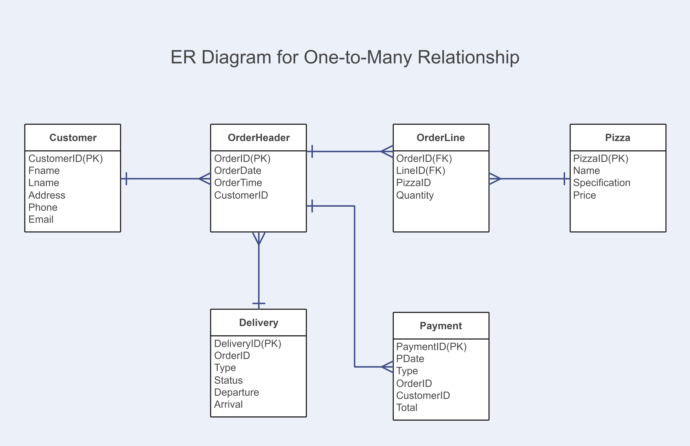
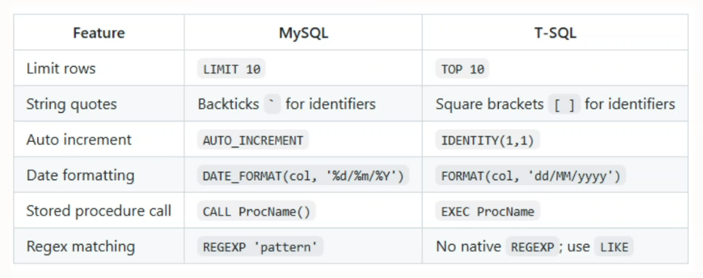
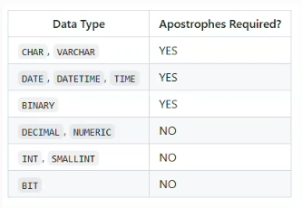

# Databases

Database = structured and accessible storage system
- Flat file database = data stored in single table
- Relational database (SQL) = data stored in related tables
- Non-relational database (NoSQL) = data without fixed table structure

## Relational Databases

Structured system that organises data into tables
- Table = entity
- Column = attribute
- Row = record

Relationships between tables established by primary and foreign keys
- Primary key = unique identifier for each row in table
    - Must be unique
    - Cannot be NULL
    - Only one per table
- Foreign key = reference to primary keys in other tables
    - Can contain duplicates
    - Enforces referential integrity
    - Reduces data redundancy

## Relational Database Managment System (RDBMS)

Software that interprets SQL instructions and enables us to create, manage and operate databases
- MySQL = most popular open-source
- PostgreSQL = more advanced and reliable open-source
- SQLite = lightweight open-source
- Microsoft SQL Server = most common in business
    - SQLServer Management Studio + Azure Data Studio = tools that allow you to interact with the database
- Oracle Database = designed for large-scale business

# Data Modelling

Show how information is organised and relationships between data
 - Conceptual = broad business understanding of data structure
    - Entity names
    - Entity relationships
 - Logical = define structure of data and relationships between them
    - Attributes
    - Primary keys
    - Foreign keys
 - Physical = specific implementation dependent on RDBMS
    - Table names
    - Column names
    - Data types

## Relationships

- One-to-one relationship (1:1) = each record in one table relates to one record in another table only
    - e.g. each row in table A is linked to no more than one row in table B
- One-to-many relationship (1:M) = one record in one table relates to multiple records in another table
    - e.g. each row in table A is linked to many rows in table B
- Many-to-many relationship (M:M) = many records in one table relate to many records in another table
    - e.g. one or more rows in table A can link to 0, 1 or many rows in table B
    - Junction table = links two tables by storing their foreign keys in one table

## Entity Relationship Diagram (ERD)

Visual representation of all entities in data model
- Each entity is represented as a table
- Each entity has a list of attributes
- Lines show relationships between entities
- Primary and foreign keys denoted as (PK) and (FK)



**Use [Drawio](drawio.io) to create ERDs**

## Crow's Foot Notation

Describe types of relationships between entities
- Minimum = closest to source entity
- Maximum = closest to destination entity
- Circle = zero
- Single line = one
- Crow's foot = many

## Normalisation

Process of separating data
- Reduces data redundancy (each piece of information is stored only once)
- Easier to maintain (one source of truth for each piece of information)
- Takes up less storage space but requires more complex queries

### Normal Forms

- First Normal Form (1NF)
    - Data is atomic (no lists, arrays, comma-separated values)
    - No repeated groups (multiple columns for same type of attribute e.g. Phone1, Phone2, Phone3)
    - Each row must be unique
- Second Normal Form (2NF)
    - Already in 1NF
    - All non-key attributes depend on the full primary key
- Third Normal Form (3NF)
    - Already in 2NF
    - Non-key attributes depend only on the primary key and not on other non-key attributes

# Structured Query Language (SQL)

Data Definition Language (DDL)
- CREATE
- ALTER
- DROP
- TRUNCATE

Data Manipulation Language (DML)
- SELECT
- INSERT
- UPDATE
- DELETE

Data Control Language (DCL)
- GRANT
- REVOKE

Transaction Control Language (TCL)
- COMMIT
- ROLLBACK
- SAVEPOINT

## MySQL vs. T-SQL

Different systems require slightly different syntax



## Data Types

-- = comment

Characters
- VARCHAR() = variable characters (set maximum length)
- VARCHAR(max) = maximum characters allowed by server
- CHAR() = fixed number of characters (e.g. phone number)
- NVARCHAR()/NCHAR() = variable characters not restricted to letters

Datetime
- DATE
- DATETIME
- TIME

Numbers
- INT = integer
- NUMERIC/DECIMAL(precision, scale) = exact decimal numbers
    - precision = total number of digits
    - scale = number of decimal places
- FLOAT = approximate decimal numbers
- BINARY() = bytes of raw data
- BIT = boolean

# Data Definition Language

## CREATE

### CREATE DATABASE

Create new database
```sql
CREATE DATABASE training;
```

### CREATE TABLE

Create new table within database, defining columns and data types for each one
```sql
USE training
CREATE TABLE films (
    film_title VARCHAR(200),
    release_date DATE,
    runtime_mins INT,
    budget DECIMAL(10,0),
    is_animated BIT
);
```

## DROP

### DROP DATABASE

Permanently delete database and all data stored in it
```sql
DROP DATABASE training;
```

### DROP TABLE

Permanently delete table and all data stored in it
```sql
DROP TABLE films;
```

### IF EXISTS

Search for database or table and delete it if it exists already, useful to avoid error when overwriting
```sql
DROP DATABASE IF EXISTS training;
CREATE DATABASE training;
```
```sql
DROP TABLE IF EXISTS films;
CREATE TABLE films (
    film_title VARCHAR(200),
    release_date DATE,
    runtime_mins INT,
    budget DECIMAL(10,0),
    is_animated BIT
);
```

## ALTER TABLE

Modify existing table

### ADD

Add new column
```sql
ALTER TABLE films
ADD director VARCHAR(100);
```

### ALTER COLUMN

Change column data type
```sql
ALTER TABLE film
ALTER COLUMN film_title VARCHAR(300);
```

### DROP COLUMN

Permanently delete column and all data stored in it
```sql
ALTER TABLE film
DROP COLUMN is_animated;
```

## CONSTRAINTS

### PRIMARY KEY

Set certain column as primary key so the server will not allow repeated or NULL values
```sql
CREATE TABLE course (
    course_id INT PRIMARY KEY,
    course_name VARCHAR (20)
);
```

### FOREIGN KEY

Assign foreign key to another table, restricting possible values to those that already exist in the source table
```sql
CREATE TABLE student (
    student_id INT PRIMARY KEY IDENTITY(1,1),
    student_name VARCHAR(20),
    course_id INT FOREIGN KEY REFERENCES course (course_id)
);

INSERT INTO student (
        student_name,
        course_id
) VALUES (
    'Bob',
    1
), (
    'Stuart',
    2
), (
    'Kevin'
    3
);
```

### IDENTITY

Server automatically generates unique identifier for each row

`IDENTITY(starting number, increment)`
```sql
CREATE TABLE course (
    course_id INT PRIMARY KEY IDENTITY(1,1),
    course_name VARCHAR(20) UNIQUE
);
```

### NOT NULL
Set certain columns not to allow NULL values

```sql
USE database_name
CREATE TABLE films (
    film_title VARCHAR(200) NOT NULL,
    release_date DATE,
    runtime_mins INT,
    budget DECIMAL(10,0),
    is_animated BIT
);
```

### UNIQUE

Set certain columns to force unique value
```sql
CREATE TABLE course (
    course_id INT PRIMARY KEY,
    course_name VARCHAR (20) UNIQUE
);
```

### DEFAULT

Set certain columns to return default value when none is specified
```sql
USE database_name
CREATE TABLE films (
    film_title VARCHAR(200) NOT NULL,
    release_date DATE,
    runtime_mins INT,
    budget DECIMAL(10,0),
    is_animated BIT DEFAULT 0
);
```

### ADD CONSTRIANT

Add rule to existing table
```sql
ALTER TABLE Spartans
ADD CONSTRAINT chkTitle CHECK (Title IN ('Mr', 'Mrs', 'Miss', 'Ms', 'Dr'))
```

# Data Manipulation Language

## INSERT INTO

Add new rows to an existing table

`Columns can be in any order but VALUES must be inserted in the same order as they are listed in INSERT INTO clause`
```sql
INSERT INTO films (
	film_title,
	release_date,
	runtime_mins,
	budget,
	is_animated
) VALUES (
	'Shrek 2',
	'2004-05-15',
	92,
	150000000,
	1
), (
	'Cars',
	'2006-05-26',
	116,
	120000000,
	1
), (
	'Princess Diaries',
	'2001-07-29',
	115,
	26000000,
	0
);
```



## UPDATE

Modify existing data
```sql
UPDATE films
SET film_title = 'Shrek'
WHERE film_title = 'Shrek 2';
```

## DELETE FROM

Permanently delete row
```sql
DELETE FROM films
WHERE film_title = 'Cars';
```