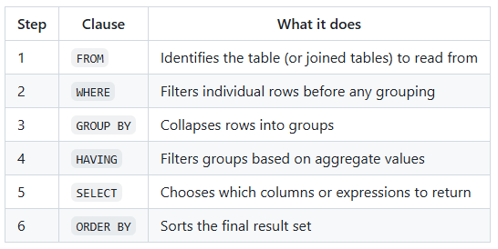
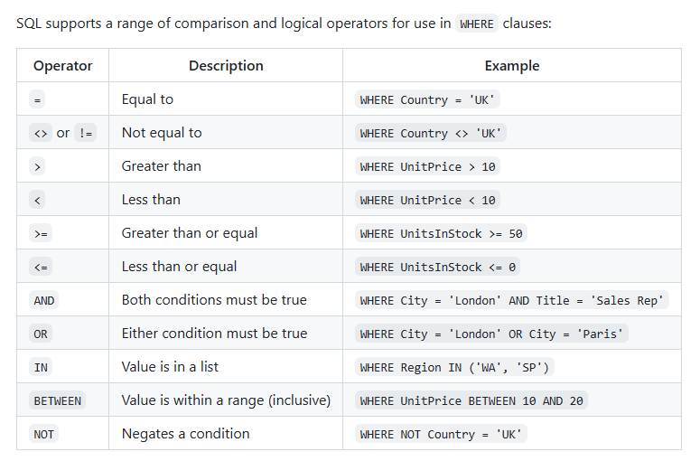
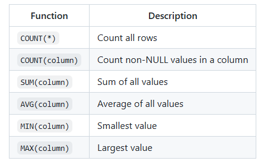

# Basic Clauses

## Syntax Sequence

1. **SELECT**
2. FROM
3. WHERE
4. GROUP BY
5. HAVING
6. ORDER BY

## Processing Sequence

1. FROM
2. WHERE
3. GROUP BY
4. HAVING
5. **SELECT**
6. ORDER BY



## Formatting

- SQL keywords in upper case
- names of columns/tables in lower case
- new line for each clause
- separate columns with comma
- separate statements with semicolon

## SELECT

Choose specific columns
- SELECT * = returns all columns in table
- SELECT AS " " = changes how column name is presented in output (alias)
- SELECT TOP X = returns top X rows only
- SELECT DISTINCT = returns unique values only once
- SELECT SUBSTRING(X, idx, len) = extracts part of a string
```sql
SELECT customer_name AS "Customer Name",
phone_number AS "Phone Number",
address AS "Address"
FROM customer;
```

## ORDER BY

Sort results alphabetically or numerically
- ASC = ascending
- DESC = descending

`Can use alias because SELECT comes before ORDER BY in processing sequence`

`Use comma to add secondary conditions in case of a tie in the first (e.g. two people with the same last name)`
```sql
SELECT last_name AS "Last Name",
first_name AS "First Name"
FROM customer
ORDER BY "Last Name" ASC, "First Name" ASC;
```

## WHERE

Filter by specific rows

`Use single quotes when searching for text`

`If the text contains a comma or apostrophe, use a single quote as an escape character`



### Conditional Operators

```sql
SELECT *
FROM customer
WHERE city = 'London';
```
```sql
SELECT *
FROM customer
WHERE city != 'London';
```

### Comparative Operators

```sql
SELECT *
FROM product
WHERE price < 20;
```
```sql
SELECT *
FROM product
WHERE available_stock >= 100;
```

### Multiple Comparisons

`Column name must be specified both times even if it is the same`
```sql
SELECT *
FROM product
WHERE price < 20
AND available_stock >= 100;
```
```sql
SELECT *
FROM customer
WHERE last_name = 'White'
OR last_name = 'Williams';
```

### Wildcards

Substitute for single character
```sql
SELECT *
FROM customer
WHERE first_name LIKE 'Is_bel';
```

Substitute for any number of characters including zero
```sql
SELECT *
FROM customer
WHERE first_name LIKE 'J%';
```

Substitute for possible character match or filter out certain characters
```sql
SELECT *
FROM product
WHERE name LIKE 'Kindle [4-9]'
OR name LIKE 'Alexa [^123]';
```

### BETWEEN

WHERE price >= 50 AND <= 100
```sql
SELECT *
FROM product
WHERE price BETWEEN 50 AND 100;
```

### IN

WHERE first_name = 'Kevin' OR first_name = 'Bob' OR first_name = 'Stuart'
```sql
SELECT *
FROM customer
WHERE first_name IN ('Kevin', 'Bob', 'Stuart');
```

### NULL

Find entries with missing data
```sql
SELECT *
FROM customer
WHERE birth_date IS NULL;
```

Filter out entries with missing data
```sql
SELECT *
FROM customer
WHERE birth_date IS NOT NULL;
```

# Functions

## Arithmetic

Manipulate numerical data
```sql
SELECT available_stock AS "Total Stock",
available_stock % 10 AS "Remaining Stock After Shipping"
FROM product;
```

## Concatenation

Combine text from multiple columns

`Always use alias because it is not an existing column`
```sql
SELECT first_name + '' + last_name AS "Full Name"
FROM customer;
```
or
```sql
SELECT CONCAT(city, ', ', country) AS "Location"
FROM customer;
```

## Datetime

`YYYY-MM-DD hh:mm:ss.s`

Return current date
```sql
GETDATE()
```
Add a number of a specified unit to a specified date
```sql
DATEADD(DAY, 5, '1970-01-01')
```
Return difference between two dates
```sql
DATEDIFF(YEAR, '1970-01-01', '1971-01-01')
```
Extract year as an integer
```sql
YEAR('1970-01-01')
```
Extract month as an integer
```sql
MONTH('1970-01-01')
```
Extract day as an integer
```sql
DAY('1970-01-01')
```
Format date output
```sql
FORMAT(Date, 'YYYY-MM')
```

## Case

Change output depending on value for each row

`Output of WHEN clause must be boolean`

`Always use alias because it is not an existing column`
```sql
SELECT name, price
    CASE
        WHEN price < 50 THEN 'Cheap',
        WHEN price < 100 THEN 'Moderate',
        ELSE 'Expensive'
    END AS "Price Category"
FROM product;
```

# Aggregations

```sql
SELECT SUM(stock) AS "Total Stock",
    AVG(stock) AS "Average Stock",
    MIN(stock) AS "Minimum Stock",
    MAX(stock) AS "Maximum Stock",
    COUNT(stock) AS "Number of Products with Non-Null Stock",
    COUNT(*) AS "Total Number of Products",
    SUM(stock * price) AS "Total Value"
FROM product;
```



## GROUP BY

Organise rows with the same value into groups for a specified column

`Everything in SELECT clause must be aggregated or grouped`
```sql
SELECT category_id AS "Category ID",
    AVG(price) AS "Average Price",
    COUNT(product) AS "Number of Products"
FROM product
GROUP BY "Category ID";
```

## HAVING

Filter based on results of aggregation

`Cannot use alias because SELECT comes after HAVING in processing sequence`
```sql
SELECT product_id AS "Product ID",
    AVG(price) AS "Average Price"
FROM product
GROUP BY "Product ID"
HAVING AVG(price) < 200;
```

# Tables

## JOIN

Combine tables when values in a row match
- First table = left table
- Second table = right table

`Specify table names to avoid confusion when both columns have the same name (table.column)`
```sql
SELECT student.name, course.name
FROM student
INNER JOIN course
ON student.course_id = course.course_id;
```
`Specify table name initial in FROM and JOIN clauses to be used as an alias`
```sql
SELECT s.name, c.name
FROM student s
INNER JOIN course c
ON s.course_id = c.course_id;
```

- LEFT JOIN = return all rows in left table and only rows in right table that match
- RIGHT JOIN = return all rows in right table and only rows in left table that match (uncommon)
- INNER JOIN = return only rows that match across both tables
- OUTER JOIN = return all rows and any that do not match will be represented by NULL

## UNION

Join rows from different tables horizontally or columns vertically

`Alias only needs to be defined once`
```sql
SELECT first_name AS "First Name",
last_name AS "Last Name"
FROM customer
UNION
SELECT first_name, last_name
FROM employee;
```
`Use UNION ALL to include duplicates`

## CREATE VIEW

Create virtual table based on query results

```sql
CREATE VIEW ProductCategorySummary AS
SELECT CategoryName
FROM Categories c
INNER JOIN Products p
	ON c.CategoryID = p.CategoryID
GROUP BY c.CategoryName;
```
Call virtual table
```sql
SELECT * FROM ProductCategorySummary
```

## SELECT INTO

Create new table from existing data in database

```sql
SELECT CompanyName INTO French_Customers
FROM Customers
WHERE Country = 'France';
```

# Stored Procedures

Group statements into reusable unit within database
- Improve performance
- Reduce risk of injection attacks
```sql
CREATE PROCEDURE UpdateCustomerPhone
	@CustomerID CHAR(5),
	@NewPhone VARCHAR(24)
AS
BEGIN
	UPDATE Customers
	SET Phone = @NewPhone
	WHERE CustomerID = @CustomerID
END;
```
Call stored procedure and enter parameters
```sql
EXEC UpdateCustomerPhone
	@CustomerID = 'ALFKI',
	@NewPhone = '0121-555-55555';
```

# Subqueries

## SELECT

Usually an aggregation which is the same for every row to be used as a reference value
```sql
SELECT OrderID,
    ProductID,
    UnitPrice,
    Quantity,
    Discount,
	(
    SELECT MAX(UnitPrice)
    FROM [Order Details]
    AS "Max Price"
)
FROM [Order Details];
```

## FROM

Create temporary virtual table to be used by outer query

`Subquery processed first due to processing sequence`
```sql
SELECT AVG("Total Price") AS "Mean Price"
FROM (
    SELECT category_id AS "Category ID",
    SUM(price) AS "Total Price"
    FROM product
    GROUP BY category_id
);
```

## WHERE

Filter results based on inner query conditions

`Can query two different tables without joining`
```sql
SELECT OrderID,
    ProductID,
    UnitPrice,
    Quantity,
    Discount 
FROM [Order Details]
WHERE ProductID IN (
    SELECT ProductID
    FROM Products
    WHERE Discontinued = 1
); 
```

# Advanced

```sql
SELECT od.ProductID, UnitPrice, "Total Amount"
FROM [Order Details] od
INNER JOIN
	(SELECT ProductID,
		SUM(UnitPrice * Quantity) AS "Total Amount"
	FROM [Order Details]
	GROUP BY ProductID
) sq ON od.ProductID = sq.ProductID;
```

# Query Optimisation

## Sargable

Keep indexed column bare on left side of comparison and perform any calculations on right side of comparison to avoid the server performing functions on every record in the table (i.e. filter first then calculate)
```sql
WHERE OrderDate >= '1997-01-01' AND OrderDate <'1998-01-01'
```
is more efficient than
```sql
WHERE YEAR(OrderDate) = 1997
```

## Indexing

Create data structure for non-key attributes that are commonly used in WHERE, JOIN, ORDER BY clauses to speed up data retrieval

### Basic index

```sql
CREATE INDEX idx_customer_city ON Customers(City);
```

### Unique index

```sql
CREATE UNIQUE INDEX idx_product_name ON Products(ProductName);
```

### Composite index

```sql
CREATE INDEX idx_orders_customer_date ON Orders(CustomerID, OrderDate);
```