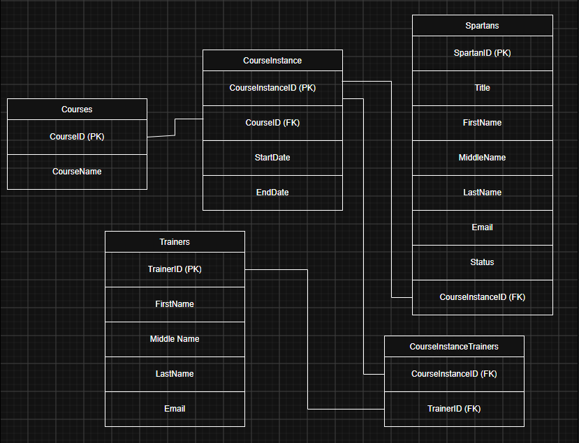

# ERD



# Creating Tables

## Courses

```sql
CREATE TABLE Courses (
	CourseID NVARCHAR(50) PRIMARY KEY,
	CourseName NVARCHAR(100) NOT NULL
);
```

## CourseInstance

```sql
CREATE TABLE CourseInstance (
	CourseInstanceID NVARCHAR(50) PRIMARY KEY,
	CourseID NVARCHAR(50) FOREIGN KEY REFERENCES Courses(CourseID),
	StartDate DATE,
	EndDate DATE
);
```

### Constraints

```sql
ALTER TABLE CourseInstance
ADD CONSTRAINT chkDate CHECK (EndDate >= StartDate);
```

## Spartans

```sql
CREATE TABLE Spartans (
	SpartanID NVARCHAR(50) PRIMARY KEY,
	Title NVARCHAR(10),
	FirstName NVARCHAR(50) NOT NULL,
	MiddleName NVARCHAR(50),
	LastName NVARCHAR(50) NOT NULL,
	Email NVARCHAR(100) UNIQUE,
	Status NVARCHAR(50) DEFAULT 'Active',
	CourseInstanceID NVARCHAR(50) FOREIGN KEY REFERENCES CourseInstance(CourseInstanceID)
);
```

### Constraints

```sql
ALTER TABLE Spartans
ADD CONSTRAINT chkTitle CHECK (Title IN ('Mr', 'Mrs', 'Ms', 'Miss', 'Dr'));
```
```sql
ALTER TABLE Spartans
ADD CONSTRAINT chkStatus CHECK (Status IN ('Active', 'Graduated', 'Withdrawn'));
```

## Trainers

```sql
CREATE TABLE Trainers (
	TrainerID NVARCHAR(50) PRIMARY KEY,
	FirstName NVARCHAR(50) NOT NULL,
	MiddleName NVARCHAR(50),
	LastName NVARCHAR(50) NOT NULL,
	Email NVARCHAR(100) UNIQUE
);
```

## CourseInstanceTrainers

```sql
CREATE TABLE CourseInstanceTrainers (
	CourseInstanceID NVARCHAR(50) FOREIGN KEY REFERENCES CourseInstance(CourseInstanceID),
	TrainerID NVARCHAR(50) FOREIGN KEY REFERENCES Trainers(TrainerID)
);
```

# Inserting Data

## Courses

```sql
INSERT INTO Courses (
	CourseID,
	CourseName
) VALUES (
	'DATA',
	'Data Engineering'
), (
	'PYTH',
	'Python'
), (
	'SQL',
	'Structured Query Language'
);
```

## CourseInstance

```sql
INSERT INTO CourseInstance (
	CourseInstanceID,
	CourseID,
	StartDate,
	EndDate
) VALUES (
	606,
	'DATA',
	'2026-09-21',
	'2026-11-21'
), (
	707,
	'PYTH',
	'2026-12-04',
	'2027-01-04'
), (
	808,
	'SQL',
	'2025-06-14',
	'2025-06-28'
);
```

## Spartans

```sql
INSERT INTO Spartans (
	SpartanID,
	Title,
	FirstName,
	MiddleName,
	LastName,
	Email,
	Status,
	CourseInstanceID
) VALUES (
	222,
	'Mr',
	'Bob',
	'Broccoli',
	'Banana',
	'bobbanana@gmail.com',
	'Active',
	606
), (
	333,
	'Ms',
	'Stuart',
	'Swede',
	'Strawberry',
	'stuartstrawberry@gmail.com',
	'Graduated',
	707
), (
	444,
	'Dr',
	'Kevin',
	'Kale',
	'Kiwi',
	'kevinkiwi@gmail.com',
	'Withdrawn',
	808
);
```

## Trainers

```sql
INSERT INTO Trainers (
	TrainerID,
	FirstName,
	MiddleName,
	LastName,
	Email
) VALUES (
	999,
	'Shrek',
	'Onion',
	'Ogre',
	'foreverafter@gmail.com'
), (
	888,
	'Fiona',
	'Tower',
	'Princess',
	'saveme@gmail.com'
), (
	777,
	'Donkey',
	'Swamp',
	'Dragon',
	'talkingdonkey@gmail.com'
);
```

## CourseInstanceTrainers

```sql
INSERT INTO CourseInstanceTrainers (
	CourseInstanceID,
	TrainerID
) VALUES (
	606,
	999
), (
	606,
	888
), (
	707,
	999
), (
	808,
	888
), (
	808,
	777
);
```