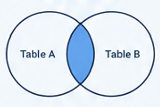
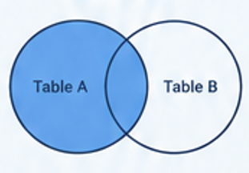
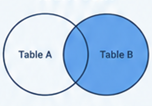
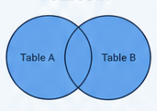

# What are JOINs?

JOIN clauses in SQL allow you to combine matched rows from two or more tables

# How do JOINs work?

JOIN clauses work by matching values in a column from one table with values in a column or columns from another table

## INNER JOIN

An INNER JOIN returns only the rows that match in both tables



*Example: returns student names and course names only where the course ID values match*
```sql
SELECT student.name, course.name
FROM student
INNER JOIN course
    ON student.course_id = course.course_id;
```

## LEFT JOIN

A LEFT JOIN returns all rows from the left (first) table and only matching rows from the right (second) table

If there is no match, the value for the right table will be NULL



*Example: returns all student names and only course names where the course ID values match (any students without a matching course ID in the course table will be represented by their name and NULL)*
```sql
SELECT student.name, course.name
FROM student
LEFT JOIN course
    ON student.course_id = course.course_id;
```

## RIGHT JOIN

A RIGHT JOIN returns all rows from the right (second) table and only matching rows from the left (first) table

If there is no match, the value for the left table will be NULL



*Example: returns all course names and only student names where the course ID values match (any courses without a matching course ID in the student table will be represented by the course name and NULL)*
```sql
SELECT student.name, course.name
FROM student
RIGHT JOIN course
    ON student.course_id = course.course_id;
```

## OUTER JOIN

An OUTER JOIN returns all rows from both tables 

If there is no match, the missing value(s) will be represented by NULL



*Example: returns all student names and all course names regardless of whether or not the course ID values match (if there is no match, the missing value will be represented by NULL)*
```sql
SELECT student.name, course.name
FROM student
OUTER JOIN course
    ON student.course_id = course.course_id;
```

# Why use JOINs?

JOIN clauses allow you to combine data from different tables so you can query and analyse it from a single result

# Exercises

## 1. Customers Orders List

Show all customers and their Order IDs
```sql
SELECT c.CompanyName,
    o.OrderID
FROM Customers c
LEFT JOIN Orders o
	ON c.CustomerID = o.CustomerID;
```

## 2. Orders with Customer Names

Show OrderID, OrderDate, and CompanyName
```sql
SELECT o.OrderID,
    o.OrderDate,
    c.CompanyName
FROM Orders o
INNER JOIN Customers c
	ON o.CustomerID = c.CustomerID;
```

## 3. Orders with Product Names

Show OrderID, ProductName, and Quantity
```sql
SELECT od.OrderID,
    p.ProductName,
    od.Quantity
FROM [Order Details] od
INNER JOIN Products p
	ON od.ProductID = p.ProductID;
```

## 4. Order Totals

Calculate the total value of each order
```sql
SELECT o.OrderID,
    SUM(od.Quantity * od.UnitPrice) AS "Total Value"
FROM Orders o
INNER JOIN [Order Details] od
	ON o.OrderID = od.OrderID
GROUP BY o.OrderID;
```

## 5. Total Spend per Customer

Show each customer and how much they’ve spent in total
```sql
SELECT c.CompanyName,
    SUM(od.Quantity * od.UnitPrice) AS "Total Value"
FROM Customers c
INNER JOIN Orders o
	ON c.CustomerID = o.CustomerID
INNER JOIN [Order Details] od
	ON o.OrderID = od.OrderID
GROUP BY c.CompanyName;
```

## 6. Customers with No Orders

Find customers who have never placed an order
```sql
SELECT c.CompanyName
FROM Customers c
LEFT JOIN Orders o
	ON c.CustomerID = o.CustomerID
WHERE o.OrderID IS NULL;
```

## 7. Products Never Ordered

Find products that have never been sold
```sql
SELECT p.ProductName
FROM Products p
LEFT JOIN [Order Details] od
	ON p.ProductID = od.ProductID
WHERE od.OrderID IS NULL;
```

## 8. Orders per Employee

Show each employee and how many orders they handled
```sql
SELECT e.FirstName + ' ' + e.LastName AS "Employee Name",
    COUNT(o.EmployeeID) AS "Number of Orders Handled"
FROM Employees e
LEFT JOIN Orders o
	ON e.EmployeeID = o.EmployeeID
GROUP BY e.FirstName, e.LastName;
```

## 9. Top 5 Customers by Spend

Show the top 5 customers based on total spend
```sql
SELECT TOP 5 c.CompanyName,
    SUM(od.Quantity * od.UnitPrice) AS "Total Spend"
FROM Customers c
INNER JOIN Orders o
	ON c.CustomerID = o.CustomerID
INNER JOIN [Order Details] od
	ON o.OrderID = od.OrderID
GROUP BY c.CompanyName
ORDER BY "Total Spend" DESC;
```

## 10. Revenue by Category

Show total revenue for each product category
```sql
SELECT c.CategoryName,
    SUM(od.Quantity * od.UnitPrice) AS "Revenue"
FROM Categories c
INNER JOIN Products p
	ON c.CategoryID = p.CategoryID
INNER JOIN [Order Details] od
	ON p.ProductID = od.ProductID
GROUP BY c.CategoryName;
```

## 11. Full Order Breakdown

Create a table showing:
- OrderID
- Customer Name
- Product Name
- Quantity
- Unit Price
```sql
SELECT o.OrderID,
    c.CompanyName,
    p.ProductName,
    od.Quantity,
    od.UnitPrice
FROM Orders o
INNER JOIN Customers c
	ON o.CustomerID = c.CustomerID
INNER JOIN [Order Details] od
	ON o.OrderID = od.OrderID
INNER JOIN Products p
	ON od.ProductID = p.ProductID;
```

## 12. Average Order Value per Customer

For each customer, show:
- Number of orders
- Total spend
- Average order value
```sql
SELECT c.CompanyName,
    COUNT(DISTINCT o.OrderID) AS "Number of Orders",
    SUM(od.Quantity * od.UnitPrice) AS "Total Spend",
    SUM(od.Quantity * od.UnitPrice) / COUNT(DISTINCT o.OrderID) AS "Average Order Value"
FROM Customers c
INNER JOIN Orders o
	ON c.CustomerID = o.CustomerID
INNER JOIN [Order Details] od
	ON o.OrderID = od.OrderID
GROUP BY c.CompanyName;
```

## 13. Employees with No Orders

Same pattern as customers with no orders
```sql
SELECT e.FirstName + ' ' + e.LastName AS "Employee Name"
FROM Employees e
LEFT JOIN Orders o
	ON e.EmployeeID = o.EmployeeID
WHERE o.OrderID IS NULL;
```

## 14. Most Popular Product

Which product has been ordered the most (by quantity)?
```sql
SELECT TOP 1 p.ProductName
FROM Products p
INNER JOIN [Order Details] od
	ON p.ProductID = od.ProductID
GROUP BY p.ProductName
ORDER BY SUM(od.Quantity) DESC;
```

## 15. Orders with Shipping Company

Show OrderID and the name of the shipper
```sql
SELECT o.OrderID, s.CompanyName
FROM Orders o
INNER JOIN Shippers s
	ON o.ShipVia = s.ShipperID;
```